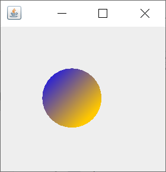

# HeadFirst-Learning-Java

## TODO
### ~~Проверить, работает ли наследование от наследника непубличного класса классом из другого пакета.~~
- Получается наследоваться от наследного публичного класса и применять его методы. Но если приватный родительский класс находится в другом пакете, методы, к которым мы хотим обращаться должны быть публичными, если мы обращаемся к методу из класса, принадлежащего другому пакету.

### ~~Посмотреть про фабричные методы.~~
- Фабричный метод позволяет заменять конструктор. Так если у нас есть конструктор:
```Java
class Employee {
    Employee(int type) {
      this.type = type;
    }
    // ...
}
```
мы можем заменить его фабричным методом:
```Java
class Employee {
    static Employee create(int type) {
        employee = new Employee(type);
        // do some heavy lifting.
        return employee;
    }
    // ...
}
```
Достоинства фабричных методов:
- Фабричный метод не обязательно возвращает объект того класса, в котором он был вызван. Зачастую это могут быть его подклассы, выбираемые в зависимости от подаваемых в метод аргументов.
- Фабричный метод может иметь более удачное имя, описывающее, что и каким образом он возвращает, например, Troops::GetCrew(myTank).
- Фабричный метод может вернуть уже созданный объект в отличие от конструктора, который всегда создает новый экземпляр.

---
| Название главы | Страницы | Тезисы |
| :---: | :---: | :---: |
| ~~Использование библиотеки Java~~ | 149 - 188 (40 страниц) | Java позволяет использовать встроенные библиотеки (Java API) для ускорения написания кода. |
| ~~Прекрасная жизнь в Объектвилле~~ | 189 - 220 (32 страницы) | Наследование и полиморфизм |
| ~~Серьезный полиморфизм~~ | 221 - 258 (38 страниц) | Интерфейсы и абстрактные классы |
| ~~Жизнь и смерть объектов~~ | 259 - 295 (37 страниц) | Конструкторы и сборщик мусора |
| ~~Числа имеют значение~~ | 296 - 337 (42 страницы) | Числа и статические члены класса |
| ~~Опасное поведение~~ | 338 - 375 (38 страниц) | Обработка исключений |
| Графический пользовательский интерфейс | 376 - 421 (46 страниц) | Очень графическая история |

---
### Глава № 6. Использование библиотеки Java
Между Array и ArrayList есть отличия. Массив обладает специфическим синтаксисом с квадратными скобками и предоставляет всего одну переменную экземпляра - length, которая возвращает длину массива. В то время как ArrayList является более гибким - обладает способностью динамически изменять размер, предоставляет множество методов для взаимодействия с элементами.

Arraylist объявляется с указанием типа в угловых скобках: 
```Java
ArrayList <String> = new ArrayList();
```

Так как списочные массивы являются массивами объектов, то для простых типов такие массивы объявляются через классы обертки:
```Java
ArrayList <Integer> = new ArrayList();
```
Java предоставляет широкий спектр библиотек, которые представлены классами внутри стандартных пакетов. Эти библиотеки позволяют пользоваться множеством функций, написанных авторами языка Java. ArrayList является одним из классов, поставляемых в этих библиотеках. Чтобы иметь возможность пользоваться такими классами, их нужно импортировать в начале класса:
```Java
import java.util.ArrayList
```
или, если хотим импортировать в свой код весь пакет util:
```Java
import java.util.*
```
Данный код позволяет нам обращаться к классу ArrayList просто по имени. Если же не делать импорт, то в коде при каждом обращении к списочному массиву мы должны писать `java.util.ArrayList`.

Разобраться в библиотеках нам поможет чтение документации. В качестве лучшего примера можно привести сайт [Oracle](https://docs.oracle.com/javase/7/docs/api/).

### Глава № 7. Наследование и полиморфизм
Наследование - механизм ООП, согласно которому существует некий абстрактный класс-родитель, содержащий в себе методы и переменные эксземпляра и передающий эти характеристики и поведение своим потомкам, которые в свою очередь могут переопределять сущетсвующие методы, а также создавать новые переменные и методы.

Уровни доступа по убыванию от самого строгого:
- private
- default
- protected
- public

Публичные (public) члены класса ***наследуются***, закрытые (private) - ***не наследуются***.

Переменные экземпляра не могут быть переопределены в дочернем классе, но их можно заново объявить.

Наследовать класс нельзя в трех случаях:
- класс не является публичным (нет ключевого слова public), при этом перед классом нельзя писать слово private. В данном случае наследование работает только внутри пакета, классы за его пределами не могут наследовать и даже пользоваться методами непубличного класса.
- класс объявлен как final, тогда он является конечной точкой в иерархии наследования. Если мы хотим защитить от переопределения метод, мы так же можем пометить его модификатором final.
- если у класса все конструкторы приватные

Также при наследовании мы можем задавать ссылку родительского типа и присваивать ей объект дочернего, что дает нам определенную степень гибкости. Например, мы можем написать метод, принимающий в качестве аргумента переменную типа родителя, и впоследствии обращаясь к данному методу, передавать ему ссылки на объекты дочернего типа.

При переопределении аргументы должны совпадать, а типы возвращаемых значений должны быть совместимы с типами оригинального метода родительского класса. Иначе это уже будет перегрузка, а не переопределение.

Уровень доступа переопределенного метода должен быть таким же или менее строгим. Так, переопределяя публичный метод в дочернем классе, мы не можем сделать его приватным.

Перегрузка - это наличие нескольких методов с одним именем, но разными наборами аргументов. При перегрузке уже можно изменять тип возвращаемого значения, а также выставлять более строгие уровни доступа. Но изменяя тип возвращаемого значения, обязательно нужно менять набор аргументов, иначе компилятор воспримет это как попытку переопределения, а при переопределении нельзя менять типа возвращаемого значения.

### Глава № 8. Интерфейсы и абстрактные классы
Абстрактный класс - класс, для которого нельзя создать экземпляр, компилятор не позволит. ***При этом мы можем использовать абстрактный тип в качестве ссылочного.*** Для объявления абстрактного класса достаточно указать ключевое слово abstract перед объявлением класса:
``` Java
abstract class Canine extends Animal {
/*длинный сложный код*/
}
```
Абстрактными могут быть не только классы, но и методы. Если абстрактный класс должен быть *расширен*, то абстрактный метод должен быть *переопределен*. Абстрактные методы не имеют тела. Их объявление выглядит так:
``` Java
public abstract void eat();
```

**Почему мы создаем абстрактные методы?**

Мы определяем некий метод, который обязательно должен присутствовать в каждом потомке. Это позволяет нам без опаски задавать в качестве аргументов методов, типов возвращаемых значений и массивов объект, имеющий ссылку типа родительского класса, потому что мы знаем, что поведение объектов типов дочерних классов, переопределяющих родительский абстрактный метод, будет схожим. Таким образом, если создать метод в неком классе, который принимает ссылку типа Animal, то наш код будет гораздо более компактным, чем если бы мы создавали отдельные методы для подтипов Animal - Dog, Cat, Wolf и тд.

Любой класс, который явно не расширяет другой класс, неявно унаследован от класса Object. В классе Object есть методы, которые
- позволяют сравнить два объекта - `obj1.equals(obj2)`, вернет значение типа boolean, метод рекомендуется переопределять в своем классе
- выведут класс объекта в формате "class Cat" - `obj1.getClass()`, вернет значение типа Class, метод финализирован, поэтому переопределить его нельзя (и не стоит)
- представят хэш-код для объекта - `obj1.hashCode()`, вернет значение типа int, метод рекомендуется переопределять в своем классе
- выведут сообщение с именем класса и цифрами, обычно этот метод переопределяется в каждом классе, чтобы выводить корректную информацию об объекте данного типа - `obj1.toString()`, вернет значение типа String

#### Опасность типа Object
Если мы напишем вот такой код
```Java
ArrayList<Object> myDogArrayList = new ArrayList<Object>();
Dog aDog = new Dog();
myDogArrayList.add(aDog);
```
он выполнится корректно, но если мы попробуем извлечь элемент из myDogArrayList и присвоить его объекту типа Dog
```Java
Dog d = myDogArrayList.get(0);
```
компилятор выдаст ошибку, потому что независимо от назначения объекта или ссылочного типа в тот момент, когда мы добавляли его в список, любой объект, выходящий из ArrayList<Object>, будет иметь тип Object.


**Компилятор решает, сможем ли мы вызвать метод, основываясь на типе ссылки, а не на фактическом типе объекта. То есть метод, который вы вызываете, должен храниться в классе ссылки данного типа, и неважно, что представляет собой объект.** Как последствие этого: если вы обращаетесь к методу по ссылке родительского типа к присвоенному ей объекту дочернего типа, то при условии, что метод родительского класса переопределяется в дочернем, будет вызвана версия из дочернего класса. При этом вы не можете обратиться к методу дочернего класса, которого нет в родительском, потому что объявленная ссылка имеет тип **родительского** класса.

Наследники вниз по иерархии могут добавлять свои методы, и в итоге с объектами типов наследников мы можем выполнять действия, описанные как в методах родителей, так и в методах самих этих классов. При этом родители понятия не имеют о методах потомков.

Если мы хотим работать с извлеченным из списка типа Object элементом, который раньше относился к типу Dog, и работать с ним уже как с объектом типа Dog, то мы можем воспользоваться приведением типов. Такой код является допустимым и будет принят компилятором:
```Java
ArrayList<Object> myDogArrayList = new ArrayList<Object>();
Dog aDog = new Dog();
myDogArrayList.add(aDog);
Object o = myDogArrayList.get(0);
Dog d = (Dog) o;
```

Но стоит производить явное приведение типов, если только мы уверены, что объект действительно относится к приводимому типу. В случае если будет выполнено приведение к типу, которому объект не принадлежит, возникнет ошибка ClassCastException. Чтобы обезопасить себя, можно добавить условие перед приведением типа, которое будет проверять принадлежность объекта указанному классу:
```Java
if (o instanceof Dog) {
  Dog d = (Dog) o;
}
```

В Java невозможно множественное наследование для избежания "Смертоносноного Ромба Смерти" (СРС), когда в двух родителях присутствуют одинаковые методы и могут возникать конфликты, когда мы пытаемся обратиться к этим методам и Java не знает, чей метод запускать. **Поэтому родитель у класса всегда один.**

Во избежание СРС можно использовать интерфейс. Интерфейс в Java практически на 100% представляет собой чистый абстрактный класс. В интерфейсе все методы абстрактные.

Для определения интерфейса используем ключевое слово interface вместо class:
```Java
public interface Pet {...}
```

Для реализации интерфейса используем слово implements перед именем интерфейса:
```Java
public class Dog extends Canine implements Pet {...}
```

Также можно реализовывать сразу несколько интерфейсов, просто перечисляя их через запятую:
```Java
public class Dog extends Canine implements Pet, Saveable, Paintable {...}
```

Все методы интерфейса неявно считаются публичными и абстрактными, поэтому писать слова public и abstract необязательно и даже не говорит о "хорошем стиле" программирования.
```Java
public interface Pet {
  void beFriendly(); //у абстрактных методов нет тела
  //или
  public abstract void play();
}
```

Первый конкретный класс должен реализовывать все абстрактные методы, заданные в родительских классах или/и реализуемом интерфейсе.

Как узнать, когда нужно создавать класс, подкласс, абстрактный класс или интерфейс:
- Создавайте класс, который ничего не наследует (не считая Object), когда ваш новый класс не проходит проверку на соответствие другим типам.
- Создавайте дочерний класс, только когда вам нужно сделать **более специфичную** версию родительского класса и заменить или добавить новое поведение.
- Используйте абстрактный класс, когда хотите определить **шаблон** для группы подклассов и у вас есть хоть какой-нибудь код реализации, который смогут применять все подклассы. Делайте класс абстрактным, когда хотите получить гарантию того, что никто не сможет создать объекты данного типа.
- Пользуйтесь интерфейсом, когда хотите определить **роль**, которую смогут играть другие классы, невзирая на то, где они находятся в иерархии наследования.

Если мы хотим не целиком переопределить метод родительского класса, а лишь добавить некий код к уже имеющемуся, мы можем использовать ключевое слово `super`. Так, если в родительском классе Report есть метод `runReport() {...}`, то в дочернем, переопределяя данный метод, мы можем обратиться к родителю:
``` Java
public class BuzzwordReport extends Report {
  void runReport(){
    super.runReport(); //обращение к родительской версии метода
    ... //новый код
  }
}
```

### Глава № 9. Конструкторы и сборщик мусора

При работе с Java программистов интересуют две области памяти: в одной находятся объекты (куча), а в другой хранятся вызовы методов и локальные переменные (стек).

**Переменные экземпляра**  - переменные, которые объявляются внутри класса, но не внутри метода. Это поля, которые содержатся в каждом конкретном объекте типа этого класса и могут иметь разные значения для каждого из таких объектов.

**Локальные переменные** - переменные, которые объявляются внутри метода или являются его параметрами (аргументами). Существуют, пока метод находится в стеке (иными словами, пока метод не достиг закрывающей скобки).

Методы размещаются в стеке. Метод, выполняющийся в данный момент, всегда находится на вершине стека. Стек состоит из стековых фреймов, хранящих метод, а также локальные переменные.

Все объекты находятся в куче, даже объекты, на которые смотрят ссылки в виде локальных переменных. То есть если локальная переменная ссылается на объект, то в стек помещается только она. Сам же объект находится в куче, управляемой сборщиком мусора.

Переменные экземпляра размещаются в куче, внутри объекта, которому они принадлежат. При создании объекта, например, new CellPhone() Java сразу выделяет место в памяти (куче) для этого объекта. Для понимания количества требуемой памяти Java складывает объемы памяти, необходимые для переменных экземпляра. Так, если объект содержит переменную int, будет выделено 32 бита, если long - 64 бита. Если CellPhone содержит объект Antenna, то есть переменную, ссылающуюся на объект, Java выделяет место в куче, необходимое для хранения ссылки (**и только ссылки!**). Но так происходит до тех пор, пока мы не присвоим ссылке объект. Так при написании `private Antenna ant;` будет выделено место только для ссылки, тогда как при написании `private Antenna ant = new Antenna();` в куче сразу будет выделено место для объекта.

Конструктор - это код, который запускается при создании экземпляра класса. Вызывается посредством ключевого слова **new** перед именем класса. Конструктор в своем объявлении похож на метод с тем отличием, что у конструктора не указывается тип возвращаемого значения и его имя обязательно совпадает с именем класса. У любого класса есть конструктор по умолчанию (не принимающий никаких аргументов), даже если вы его явно не задаете. Однако, если создать в классе хотя бы один конструктор самостоятельно, компилятор уже не будет создавать пустой конструктор по умолчанию самостоятельно. Рекомендуется всегда создавать конструктор без аргументов и предусматривать в нем значения по умолчанию, чтобы облегчить программистам работу по созданию объектов. Создание конструктора выглядит так:
```Java
public CellPhone() {
  ...//код, выполняемый конструктором при создании нового объекта класса
}
```

Конструктор можно использовать для инициализации состояния объекта, то есть задания значений переменных:
```Java
public class Duck {
  int size;
  public Duck (int newSize) {
    size = newSize;
  }
}
```

Если вы не задали в конструкторе значения для переменных экземпляра, по умолчанию они устанавливаются для 0/0.0/false, а для ссылок - null.

Конструкторы можно перегружать, если задавать для них разные параметры и их типы. Таким образом, код ниже допустим:
```Java
public class Mushroom {
  public Mushroom (int size) {} //если мы знаем только размер
  public Mushroom () {} //если мы не знаем ничего
  public Mushroom (boolean isMagic) {} //если мы знаем, что гриб волшебный
  /*Ниже два варианта конструктора, когда мы знаем и о волшебных свойствах гриба, и о его размере. 
  Такой код допустим: хоть и параметры методов одинаковы, но они размещены в разном порядке*/
  public Mushroom (boolean isMagic, int size) {}
  public Mushroom (int size, boolean isMagic) {}
}
```

При создании объектов дочернего класса создаются переменные экземпляра всех родительских классов. Также при запуске дочернего конструтора запускаются конструкторы всех родительских классов, так как дочерние элементы зависят от родительских и это значит, что родительский объект должен быть полностью сформирован, включая все его переменные экземпляра, для корректной работы потомка. Таким образом, родительский конструктор должен быть завершен раньше, чем дочерний. Этот процесс называется связыванием (формированием цепочки) конструкторов. Наглядно это видно на картинке ниже:


Если вы хотите напрямую вызвать родительский конструктор из дочернего, то внесите в дочерний конструктор вызов `super()`. Так будет вызван родительский конструктор по умолчанию. Комиплятор помещает неявно вызовы родительского конструктора посредством ключевого слова `super()`, если вы явно не указали этого.

Внутрь вызова `super()` мы можем передавать аргументы конструкторов родителя и тогда будут вызываться соответствующие конструкторы. Например, если у родителя есть конструктор `Animal(int size)`, в конструкторе потомка мы можем использовать вызов `super(10)`.

Для вызова одного конструктора из другого (в рамках одного класса) можно написать ключевое слово `this()`. Оно должно идти самым первым в конструкторе. Таким образом, мы не можем написать в одном конструкторе и `this()`, и `super()`:
``` Java
class Mini extends Car {
  Color color;
  
  public Mini() {
    this(Color.Red);
  }
  
  public Mini(Color c) {
    super("Mini");
    color = c;
    //Дальнейшая инициализация
  }
  
  /*код ниже не будет работать, так как в одном конструкторе и super(), и this(), а они оба должны идти в первом выражении
  public Mini(int size) {
    this(Color.Red);
    super(size);
  }*/
}
```

Область видимости локальных переменных ограничена рамками метода - пока метод не достиг закрывающей скобки, локальная переменная существует, но является видимой, только когда данный метод находится на вершине стека. Таким образом, если метод вызывает внутри себя другой метод, локальная переменная исходного метода не будет доступна во время выполнения вложенного.

Объект же живет, пока есть хотя бы одна ссылка на него. Когда же все ссылки на объект стерты, он становится доступен сборщику мусора. Три способа избавиться от ссылки на объект:
- ссылка перестает быть видимой, когда она существует в рамках метода
```Java
void go() {
  Life z = new Life();
}
```
- ссылке присваивается другой объект
```Java
Life z = new Life();
z = new Life();
```
- ссылке явно присваивается null
```Java
Life z = new Life();
z = null;
```

### Глава № 10. Числа и статические члены класса

Если поведение метода не зависит от значения переменной экземпляра, как, например, происходит с методом round() класса Math, то такой метод можно объявить статическим. Чтобы вызвать статический метод, мы должны обращаться не к переменной экземпляра, а к самому классу Math:
```Java
int x = Math.round(42.2);
int y = Math.min(56, 12);
int z = Math.abs(-343);
```

Таким образом, ключевое слово `static` позволяет работать методу без переменной экземпляра, так как его поведение не зависит от значения данной переменной.

Например, в коде ниже метод `play()` зависит от значения переменной экземпляра, так как внутри этого метода происходит обращение к переменной `title` и для каждой переменной экземпляра Song метод `play()` будет проигрывать разные композиции в зависимости от значения `title`:
```Java
public class Song {
  String title;
  public Song(String t) {
    title = t;
  }
  public void play() {
    SoundPlayer player = new SoundPlayer();
    player.playSound(title);
  }
}
```

Статические методы не могут использовать не статические переменные (то есть относящиеся к конкретному объекту) и не статические методы (так как статические методы не видят состояние полей). Так, например, код ниже не скомпилируется, так как метод `getSize()` и переменная `size` в методе `main` не привязаны ни к какому объекту:
```Java
public class Duck {
  private int size;
  
  public static void main (String[] args) {
    System.out.println("Размер равен" + size);
    System.out.println("Размер равен" + getSize());
  }
  
  public void setSize(int s) {
    size = s;
  }
  
  public void getSize() {
    return size;
  }
}
```

**Статическая переменная** - переменная, имеющая один экземпляр на весь класс. Так что если мы создаем несколько объектов типа Duck, представленного ниже, переменная `duckCount`, считающая количество уток, всё же будет одна:
```Java
public class Duck {
  private int size;
  private static int duckCount = 0;
  
  public Duck() {
    duckCount++;
  }
  
  public void setSize(int s) {
    size = s;
  }
  
  public void getSize() {
    return size;
  }
}
```

Если бы переменная `duckCount` не являлась статической, при каждом создании экземпляра класса Duck переменная `duckCount` определялась по новой для этого объекта возвращалась в значение 0. Слово static выручает нас в этом случае. Можно сказать, что статическая переменная живет в классе, а не в объекте.


Статические переменные инициализируются при загрузке класса.

Чтобы объявить константу, надо указать идентификаторы static final. Так, например, число Пи в классе Math объявлено так:
```Java
public static final double PI = 3.141592653589793;
```

По соглашению об именовании **имена констант должны быть написаны в верхнем регистре с символами подчеркивания разделяющими слова!** Например, PI, FOO_X и т.д.

Инициализируются константы:
- при объявлении:
public static final int FOO_X = 25;
- в статическом блоке инициализации (этот код запускается сразу после загрузки класса перед вызовом любого статического метода и прежде, чем может быть использована любая статическая переменная):
```Java
static {
  FOO_X = 25;
}
```

Если статическую переменную не инициализировать, ей будет присвоено значение по умолчанию. Если же не инициализировать статическую финализированную переменную, то компилятор выдаст ошибку **variable FOO_X might not have been initialized**.

Присваивать значение финализированной переменной нужно либо во время её объявления, либо при создании конструктора.

Модификатор final можно использовать для обозначения не статических переменных, включая переменные экземпляра, локальные переменны и параметры методов - тогда значение этих переменных не будет меняться, а также чтобы запретить переопределение методов или создание дочерних классов.

Статический метод не имеет доступа к не статическим переменным и методам, но не статический метод может работать со статическими переменными и методами.

Если класс содержит исключительно статические методы и мы не хотим создавать его экземпляры, то можно сделать его конструктор приватным.

Методы Double.parseDouble(String), Integer.parseInt(String) принимают строковое написание числа и конвертируют его в соответствующий числовой тип. Например, `Integer.parseInt("2")` вернет целочисленное значение 2. Отличается получение из строки значения типа boolean: `boolean b = new Boolean("true").booleanValue();`.

Чтобы, наоборот, преобразовать любое значение в строку, стоит выполнить операцию `"" + foo`. Или можно воспользоваться методом toString из классов-оберток, принимающих соответствующий классу примитив. Например, код
```Java
int a = 1;
String b = Integer.toString(a);
```
запишет в b значение "1".

#### Форматирование чисел
Метод `String.format()` принимает два аргумента:
1. спецификаторы форматирования (начинается со знака %)
2. число, которое надо отформатирования

Параметры спецификатора форматирования (части в скобках необязательны, порядок следования параметров строгий):

%[номер аргумента][флаги][ширина][.разрядность]тип


В примере выше не указан номер аргумента, но все остальные спецификаторы присутствуют. Тип всегда обязателен и указывается последним.

Типы модификаторов: %d - целые числа (byte, short, int, char и их обертки, но не long), %f - дробные числа (float, double, их обертки и BigDecimal), %x - шестнадцатеричное число (byte, short, int, long, их обертки и BigInteger) - преобразует числа в их шестнадцатеричный эквивалент, %c - символ (byte, short, char, int и их обертки). Существует еще множество типов, но пока достаточно этих двух.

Например, строка ниже выведет число 1,000,000,000.46:
```Java
System.out.println(String.format(US, "%,.2f", 1000000000.455726));
```
Разберем эту строку по порядку:
- "US" означает американский стиль форматирования чисел (разделение разрядов запятыми)
- флаг "," означает разделение по разрядам, без этого идентификатора даже при наличии локализатора "US" число будет выведено без разделителей, а если убрать "US", но оставить флаг ",", то число будет выведено в виде 1 000 000 000.46
- .2 говорит компилятору, что нужно вывести два десятичных знака
- f означает тип дробного числа

#### Форматирование дат
Типы модификаторов:
- %tc выведет полный формат даты
- %tr - просто время
- %tA - день недели
- $tB - месяц
- %td - число

Пример:
```Java
Date today = new Date();
String.format("%tA %tB %td", today, today, today);
```
Возвратится, например, "Воскресенье, Ноябрь 28". Чтобы не писать переменную `today` три раза, можно модифицировать строку следующим образом:
```Java
String.format("%tA %<tB %<td", today);
```

Угловая скобка (<) - ещё один флаг, который говорит "используй предыдущий аргумент ещё раз".

**Для текущих временных меток применяется класс java.util.Date, для всего остального java.util.Calendar.** Но Calendar - абстрактный класс, поэтому мы будем работать с его потомками. Тип календаря, который мы получим, зависит от региональных настроек, и в большинстве стран это будет java.util.GrigorianCalendar. Но всегда можно найти библиотеки для работы с другими календарями, такими как японский, исламский, буддистский.

Чтобы получить экземпляр дочернего класса мы должны выполнить следующую команду:
```Java
Calendar cal = Calendar.getInstance();
```

В большей части стран мы получим в ответ экземпляр класса java.util.GrigorianCalendar.

Методы для редактирования даты:


Основные методы класса Calendar:
- **add(int field, int amount)** - добавляет или вычитает время из поля календаря
- **get(int field)** - возвращает значение заданного поля календаря
- **getInstance()** - возвращает экземпляр Calendar, можно задать региональные настройки
- **getTimeInMillis()** - возвращает время в миллисекундах (тип long)
- **roll(int field, boolean up** -  добавляет или вычитает время без изменения старших полей
- **set(int field, int value)** - устанавливает значения для заданного поля
- **set(int year, int month, int day, int hour, int minute)** - популярная разновидность метода set для детальной установки времени
- **setTimeInMillis(long millis)** - устанавливает время для объекта Calendar, основываясь на миллисекундах (тип long)

#### Статический импорт
Позволяет импортировать статические методы, переменные или перечисления, чтобы не набирать их по многу раз. Пример:
```Java
import static java.lang.System.out;
import static java.lang.Math.*;

public class TestBox {  
  out.println("Красивая квадратная коробка с ребром " + sqrt(4.0) + " метра.");
}
```
В примере выше благодаря статическому импорту мы легко можем обращаться к переменной `out` класса `System` и методу `sqrt` класса `Math`.

**Примечание:**
- во избежание путаницы и для улучшения читаемости кода лучше не злоупотреблять статическим импортом и прибегать к нему, если определенные статические члены используются часто
- существенная проблема статического импорта заключается в возможных конфликтах. Так, например, если у нас есть два класса с методом add(), то компилятор не сможет понять, какой из них использовать

### Глава № 11. Обработка исключений

Исключения - особые объекты, которые объявляются в методах для обработки непредвиденных ситуаций, таких как отключение сервера или отсутствие файла, к которому происходит обращение. Все исключения наследуются от класса Exception, который в свою очередь наследуется от Throwable. Throwable содержит методы `getMessage()` и `printStackTrace()`, который позволяет получить трассировку стека. Если исключение (кроме наследников RuntimeException) не обработать, при компиляции будет выброшено unreported exception и программа не скомпилируется.

Чтобы выбросить исключения, нужен следующий код:
```Java
public void takeRisk() throws BadException /*так метод сообщает, что выбрасывает BadException*/ {
  if (abandonAllHope) {
    throw new BadException(); //создаем новый объект Exception и выбрасываем его
  }
  System.out.println("Конец опасного метода");
}
```

В случае выбрасывания исключения строчка "Конец опасного метода" выведена не будет, потому что код метода, выбрасывающего исключения, срабатывает только до момента выброса исключения. Если же исключение выброшено не будет, строка "Конец опасного метода" будет выведена при вызове метода.

Чтобы отловить исключение, используется вот такой код:
```Java
public void crossFingers() {
  try {
    anObject.takeRisk();
  } catch (BadException ex) {
    System.out.println("Аах!");
    ex.printStackTrace(); //если мы не справляемся с исключением, то хотя бы можем вывести трассировку стека
  }
}
```

Компилятор не даст нам оставить метод `crossFingers()` без отлавливания исключения, так как он знает, что метод `takeRisk()` объявил (выбрасывает) это исключение. Компилятор проверяет все исключения, кроме наследников RuntimeException. Мы можем выбрасывать, отлавливать и проверять и наследников RuntimeException, но это необязательно. Все исключения, которые интересны компилятору, называются проверяемыми.

Если требуется выполнить какой-то код независимо от того, будет выброшено исключение или нет, можно продублировать код в try и catch (**это плохой подход**) или использовать блок finally (**это good practice**):
```Java
try {
    turnOvenOn();
    x.bake();
} catch (BakingException ex) {
    ex.printStackTrace();
} finally {
    turnOvenOff();
}
```

- В итоге если один из методов блока try завершится неудачей, другие методы выполнятся не будут, и управление программным потоком немедленно перейдет в блок catch. После блока catch будет выполнен код из блока finally.
- Если блок try будет выполнен без выброса исключений, код в блоке catch выполняться не будет, а управление перейдет в блок finally.
- Если блоки try или catch содержат оператор return, то блок finally все равно будет выполнен. Поток перейдет к finally, а потом вернется к return.

Также метод может выбросить сразу несколько исключений (правда если два или более исключения, выбрасываемых методом, принадлежат одному родительскому классу, при объявлении можно ограничиться одним родительским классом):
```Java
public class Laundry () {
  public void doLaundry() throws PantsException, LingerieException {
    // Код, который может выбросить оба исключения
  }
}
```

Чтобы их обработать, нужно сделать несколько блоков catch:
``` Java
public class Foo {
  public void go() {
    Laundry laundry = new Laundry();
    try {
      laundry.doLaundry();
    } catch(PantsException pex) {
      // Восстановительный код
    } catch(LingerieException lex) {
      // Восстановительный код
    }
  }
}
```

Так как исключения - это объекты, в методе мы можем объявлять родительский класс исключений и тогда нам не нужно будет перечислять потомков:
```Java
public class Laundry () {
  public void doLaundry() throws ClothingException {
    // Код, который может выбросить исключения типов PantsException, LingerieException, TeeShirtException, DressShirtException, не объявляя каждое из них в отдельности
  }
}
```

Также мы можем перехватывать выбрасываемые исключения с помощью их родительского типа. Код ниже может поймать любой тип ClothingException:
```Java
try {
  laundry.doLaundry();
} catch(ClothingException cex) {
  // Восстановительный код
}
```

Но к обращению к исключениям родительского типа стоит прибегать только в тех случаях, когда поведение при дочерних ошибках должно быть одинаковым. Если же, например, при ошибках PantsException и LingerieException ожидается различное поведение, нужно делать отдельные блоки catch для них. Если же остальных потомков ClothingException мы обрабатываем одинаково, то их можно поместить в один блок catch:

```Java
try {
  laundry.doLaundry();
} catch(PantsException pex) {
  // Восстаноление после PantsException
} catch(LingerieException lex) {
  // Восстаноление после LingerieException
} catch(ClothingException cex) {
  // Восстаноление после all others
}
```

**Множественные блоки catch должны располагаться по возрастанию: от меньшего к большему.** Так сначала мы должны расположить блок catch для отлова ошибка TeeShirtException, потом - для отлова ShirtException (TeeShirtException уже не дойдет до этого блока), затем - для ClothingException (туда уже не дойдут исключения TeeShirtException) и т.д. Блоки одного уровня могут располагаться в любом порядке. Но нельзя размещать большие блоки над маленькими - тогда код не скомпилируется.

Чтобы не обрабатывать исключение, можно его пробросить (объявить в методе, вызывающем опасный метод), вписав его в throws. Так, например, метод ниже вызывает опасный метод `doLaundry()`, не обрабатывая его:
```Java
public void foo() throws ClothingException {
  // Вызов опасного метода без блоков try/catch
  laundry.doLaundry();
}
```

Так можно делать вплоть до метода `main()` включительно, этот код все равно скомпилируется, но код выполнен не будет, так как методы выбрасывают необработанные исключения.

В итоге у нас есть два способа удовлетворить компилятор:
- обработать исключение с помощью блока try/catch
- объявить его в своем методе повторно, копируя ошибку объявленную в вызванном опасном методе

Правила для исключений:
- нельзя использовать блоки catch или finally без try
- нельзя добавлять код между блоками try и catch типа 
``` Java
try {
  /*код*/
}
int y = 5;
catch (Exception ex) {
  /*код*/
}
```
- за блоком try обязательно должны следовать либо catch, либо finally
- при использовании блока try с finally (без catch) нужно объявить (пробросить) исключение:
```Java
void go() throws FooException {
  try {
    x.doStuff();
  } finally { }
}
```

**Создание MIDI-проигрывателя:**
```Java
import javax.sound.midi.*;

public class MiniMiniMusicApp {
    public static void main(String[] args) {
        MiniMiniMusicApp mini = new MiniMiniMusicApp();
        mini.play();
    }

    public void play() {
        try {
            Sequencer player = MidiSystem.getSequencer();
            player.open();

            Sequence seq = new Sequence(Sequence.PPQ, 4);

            Track track = seq.createTrack();

            ShortMessage a = new ShortMessage();
            a.setMessage(144, 1, 44, 100); // 144 - тип сообщения (начало проигрывания ноты), 1 - канал, 44 - нота (от 0 до 127, начиная с низких и заканчивая высокими), 100 - скорость и сила нажатия (от 0 до 100)
            MidiEvent noteOn = new MidiEvent(a, 1); // обозначает время события a - начать проигрывание ноты 44 в первом такте
            track.add(noteOn); // добавить событие noteOn в трек

            ShortMessage b = new ShortMessage();
            b.setMessage(128, 1, 44, 100); // 128 - конец проигрывания ноты
            MidiEvent noteOff = new MidiEvent(b, 16); // обозначает время события b - закончить проигрывание ноты 44 в шестнадцатом такте
            track.add(noteOff);

            player.setSequence(seq);
            player.start();

        } catch (Exception ex) {
            ex.printStackTrace();
        }

    }
}
```

MIDI-инструкции хранятся в объекте Message. Событие MidiEvent - это сочетание сообщения и момента времени, когда это сообщение должно сработать. Иными словами, объект Message говорит: "Начать проигрывать среднее "до"", тогда как MidiEvent означает: "Запустить это сообщение на четвертом такте". Всегда нужно иметь и Message, и MidiEvent. Message говорит, *что* делать, а MidiEvent - *когда* это делать.

1. Создаем **сообщение**. 
```Java
ShortMessage a = new ShortMessage(); 
```
2. Помещаем в сообщение **инструкцию**. Сообщение гласит "Начать проигрывать ноту № 44".
```Java
a.setMessage(144, 1, 44, 100);
```
3. Используя сообщение, создаем новое **событие**. Инструкции хранятся в сообщении, но MidiEvent дополняет их информацией о моменте времени, в который они должны сработать. Этот экземпляр MidiEvent говорит, что сообщение *a* сработает в первом такте (бит 1).
```Java
MidiEvent noteOn = new MidiEvent(a, 1);
```
4. Добавляем событие в **трек**. Трек хранит все события MidiEvent. Они размещаются в последовательности согласно времени срабатывания, а синтезатор проигрывает их в заданном порядке. В один момент времени у вас может произойти несколько событий. Например, вам понадобится проиграть одновременно две ноты или даже несколько звуков из разных инструментов.
```Java
track.add(noteOn);
```


Инструмент можно поменять до получения сообщения о проигрывании ноты. При этом стандартный канал № 1 (фортепиано) меняется на другой. Это сообщение имеет номер 192, а его третий аргумент служит для выбора инструмента (от 0 до 127).
```Java
first.setMessage(192, 1, 102, 0); // 192 - сообщение об изменении инструмента, 1 - канал № 1 (первый музыкант), 102 - номер инструмента
```

### Глава № 12. Графический пользовательский интерфейс
#### Все начинается с окна
JFrame - это объект, который представляет окно на экране. В нем могут находиться различные виджеты: кнопки, флажки, поля ввода и т.п. Также окно может иметь строку меню с пунктами. А также окно на любой платформе содержит кнопки сворачивания, разворачивания и закрытия окна.

```Java
import javax.swing.*; // импортируем содержимое пакета javax.swing, содержащее JFrame и JButton  
// (на коде ниже JButton нет, но если мы заменим на него обычный Button, то поведение будет кнопка 
// таким же, только будет иметь другой вид (показано на скриншотах ниже)
import java.awt.*; // импортируем содержимое пакета java.awt, содержащее Button

public class SimpleGui1 {
    public static void main(String[] args) {
        JFrame frame = new JFrame(); // создание фрейма
        Button button = new Button("click me"); // создание кнопки, передаем ее конструктору текст, с которым она будет отображаться

        frame.setDefaultCloseOperation(JFrame.EXIT_ON_CLOSE); // Эта строка завершает работу программы при закрытии окна (иначе приложение бы работало вечно) 

        frame.getContentPane().add(button); // добавляем кнопку на панель фрейма - добавить кнопку сразу на фрейм нельзя. Можно представлять фрейм как оконную раму, а элементы мы добавляем на стекло.
        
        frame.setSize(400, 400); // присваиваем фрейму размер в пикселях
        frame.setVisible(true); // делаем фрейм видимым (если пропустить этот шаг, то, запустив данный код, мы ничего не увидим) 
    }
}
```
Первый скриншот - кнопка типа Button из пакета java.awt, второй скриншот - кнопка типа JButton из пакета javax.swing


Кажется, что наша кнопка ничего не делает, но на самом деле, когда мы нажимаем на нее, она как бы вдавливается. Теперь главный вопрос, как заставить ее делать то, что мы хотим.

Мы можем выбирать дизайн кнопки среди нескольких классов "внешнего вида" в библиотеке. В большинстве случаев предоставляется на выбор хотя бы два вида: 
- стандартное оформление Java, известное как Metal
- родное оформление нашей платформы

Но не все варианты оформления доступны на каждой платформе.

Когда мы нажимаем на кнопку, должно срабатывать событие. Выражаясь терминами Java, **источник события** представляет собой объект, который может преобразовывать действия пользователя (щелчок кнопки, нажатие клавиши, закрытие окна) в события. События, как и все остальное в Java, представляет собой объект. Они принадлежат одному из классов пакета java.awt.event. Если нас интересуют события кнопки, нужно реализовать интерфейс, который скажет: "Я отслеживаю твои события". Каждый тип события имеет соответствующий ему интерфейс для отслеживания: MouseEvent - MouseListener, WindowEvent - WindowListener.Но мы должны реализовывать все методы, содержащиеся в интерфейсе. Например, для MouseListener это методы mousePressed (кнопка мыши нажата), mouseReleased (кнопка мыши отпущена), mouseMoved (мышь двигается) и т.д. Таким образом, для событий мыши существует только один объект события - MouseEvent, но при этом есть несколько различных методов, представляющих различные типы событий мыши.

```Java
package sec02;

import javax.swing.*;
import java.awt.event.ActionEvent; // импорт ивента ActionEvent
import java.awt.event.ActionListener; // импорт соответствующего ивенту лисенера

// Реализуем интерфейс ActionListener. Так как кнопка будет передавать
// события только тем, кто реализует ActionListener
public class SimpleGui1B implements ActionListener {
    JButton button;

    public static void main(String[] args) {
        SimpleGui1B gui = new SimpleGui1B();
        gui.go();
    }

    public void go() {
        JFrame frame = new JFrame();
        button = new JButton("Click me!");

        /* Регистрируем нашу заинтересованность в кнопке: Данный метод
        добавляет ссылку на наш объект в список слушателей кнопки.
        Передаваемый аргумент ДОЛЖЕН быть объектом класса, реализующего
        ActionListener. this указывает, что мы передаем объект ЭТОГО класса.
        Когда пользователь нажимает на кнопку, она запускает событие,
        вызывая метод actionPerformed(), принадлежащий каждому слушателю в списке. */
        button.addActionListener(this);

        frame.getContentPane().add(button);
        frame.setDefaultCloseOperation(JFrame.EXIT_ON_CLOSE);
        frame.setSize(300, 300);
        frame.setVisible(true);
    }

    /* Реализуем метод actionPerformed() интерфейса ActionListener. Это фактический метод
    обработки событий. Через ссылку на объект из списка слушателей кнопка вызывает этот метод,
    чтобы известить о наступлении события. Она отправляет объект типа ActionEvent как аргумент,
    но он нам не нужен. Достаточно знать, что событие наступило. */
    public void actionPerformed(ActionEvent event) {
        button.setText("I've been clicked!");
    }
}
```

Большая часть кода, которую мы пишем на Java, будет принимать события, а не являться их источником.

Большинство событий, которые могут нас заинтересовать, запускаются классами в API Java, и мы должны быть только их слушателем. Однако можно разработать программу, где понадобится пользовательское событие, скажем, StockMarketEvent. Оно будет вызываться, например, когда наше приложение по наблюдению за фондовой биржей найдет что-нибудь, по ее мнению, важное. В этом случае мы создаем объект StockWatcher — источник события и делаем то же самое, что делает кнопка (или любой другой источник). Иными словами, создаете интерфейс слушателя для своего пользовательского события, регистрируем метод(addStockListener()), a когда кто-нибудь вызывает его, добавляем вызвавшую сторону в список слушателей. Затем, когда происходит событие, создаем экземпляр класса StockEvent (еще один класс, который мы напишем) и отправляем его слушателям в своем списке, вызывая их метод stockChanged(StockEvent). Нужно также не забыть, что для каждого типа события должен быть свой интерфейс слушателя (поэтому мы создаем интерфейс StockListener с методом stockChanged()).

Во фреймы мы можем вставлять также какие-то кастомные объекты, рисунки и тд. Ниже мы создаем объект, наследник JPanel, который будет являться полноценным виджетом, таким же, как кнопка, меню и т.д.

```Java
import javax.swing.*;
import java.awt.*;

/* Создаем наследника JPanel - виджет, который мы можем добавлять во фрейм,
как любой другой. Только это будет наш пользовательский виджет. */
public class MyDrawPanel extends JPanel {
    
    /* Мы переопределяем большой важный графический метод. Мы не будем вызывать его сами.
     Система вызывает его и говорит: "Вот прекрасная новая поверхность для рисования,
     принадлежащая типу Graphics, и ты можешь на ней рисовать." */
    public void paintComponent (Graphics g) {
        /* Можно представить, что g - это машина для рисования, которой мы
         передаем информацию, каким цветом и какую фигуру рисовать (с 
         координатами местоположения и размерами). */
        g.setColor(Color.ORANGE);
        g.fillRect(20, 50, 100, 100);
    }
}
```

Результат кода при вызове объекта MyDrawPanel в классе SimpleGui1:


Есть множество вариантов изображения графического интерфейса. Например, вставим цветной круг на черном фоне во фрейм, переопределяя уже знакомый нам метод `paintComponent()`:
```Java
import javax.swing.*;
import java.awt.*;

public class MyDrawPanel extends JPanel {
    public void paintComponent (Graphics g) {
        /* Закрашиваем всю панель черным (цвет по умолчанию).
         Два первых аргумента определяют координаты по отношению
         к левому и верхнему краям. Два других аргумента говорят
         сделать у прямоугольника ширину и высоту, как у панели. */
        g.fillRect(0, 0, this.getWidth(), this.getHeight());

        int red = (int) (Math.random() * 255);
        int green = (int) (Math.random() * 255);
        int blue = (int) (Math.random() * 255);

        Color randomColor = new Color(red, green, blue); // задаем цвет тремя целыми числами, представляющими RGB-значения
        g.setColor(randomColor);
        g.fillOval(70, 70, 100, 100); // начинаем рисование с 70 пикселей сверху и слева, задаем ширину и высоту по 10 пикселей
    }
}
```
Результат кода при вызове объекта MyDrawPanel в классе SimpleGui1:


У класса Graphics, содержащего простые методы для рисования и работы с цветом, есть более продвинутый потомок Graphics2D. На самом деле в методе `paintComponent(Graphics)` за ссылкой типа Graphics обычно скрывается объект типа Graphics2D.

Graphics содержит методы `drawImage()`, `drawLine()`, `drawPolygon()`, `drawRect()`, `drawOval()`, `fillRect()`, `fillRoundRect()`, `setColor()`. В Graphics2D есть методы `fill3DRect()`, `draw3DRect()`, `rotate()`, `scale()`, `shear()`, `transform()`, `setRenderingHints()`. Но это не полный перечень методов.

Попробуем нарисовать круг, используя в качестве заливки вместо обычного цвета градиент:

```Java
import javax.swing.*;
import java.awt.*;

public class MyDrawPanel extends JPanel {
    public void paintComponent (Graphics g) {
        Graphics2D g2d = (Graphics2D) g; /* приводим объект Graphics2D, замаскированный под обычный Graphics
        к его настоящему типу, чтобы иметь возможность вызывать методы, доступные лишь Graphics2D. */
        
        /* Задаем градиент цвета. Синий цвет начинается с точки (70, 70), а оранжевый - с точки (150, 150). */
        GradientPaint gradient = new GradientPaint(70, 70, Color.blue, 150, 150, Color.orange);

        g2d.setPaint(gradient); // назначаем виртуальной кисти градиент вместо сплошного цвета
        // в комментарии ниже видно, как я попробовал сделать плавающий размер овала - он будет меняться в зависимости от изменения размеров окна
        //g2d.fillOval(70, 70, (int) (this.getWidth() * 0.7), (int) (this.getHeight() * 0.7));
        g2d.fillOval(70, 70, 100, 100); // в данном случае овал будет закрашен тем, что находится на кисти g2d - градиентом
    }
}
```

Результат:



Тот же код, но с использованием генератора случайных чисел для получения случайных цветов:

```Java
import javax.swing.*;
import java.awt.*;

public class MyDrawPanel extends JPanel {
    public void paintComponent (Graphics g) {
        Graphics2D g2d = (Graphics2D) g;

        int red = (int) (Math.random() * 255);
        int green = (int) (Math.random() * 255);
        int blue = (int) (Math.random() * 255);
        Color startColor = new Color(red, green, blue);

        red = (int) (Math.random() * 255);
        green = (int) (Math.random() * 255);
        blue = (int) (Math.random() * 255);
        Color endColor = new Color(red, green, blue);

        GradientPaint gradient = new GradientPaint(70, 70, startColor, 150, 150, endColor);

        g2d.setPaint(gradient);
        //g2d.fillOval(70, 70, (int) (this.getWidth() * 0.7), (int) (this.getHeight() * 0.7));
        g2d.fillOval(70, 70, 100, 100);
    }
}
```

Результат:


#### Ключевые моменты
##### События
- Чтобы создать GUI, начните с окна. Как правило, это JFrame:

`JFrame frame = new JFrame();`
  
- Вы можете добавлять виджеты (кнопки, поля ввода и т.д.) в JFrame, используя запис вида:

`frame.getContentPane().add(button);`
  
- В отличие от большинства других компонентов, JFrame не позволяет добавлять в него объекты напрямую, поэтому приходится делать это через панель содержимого, принадлежащую JFrame.
  
- Чтобы вывести на экран окно (JFrame), нужно сдлеать его видимым и указать размер:
```Java
frame.setSize(300, 300);
frame.setVisible(true);
```

- Для отслеживания событий нужно обозначить свой интерес к источнику события. Источник события -- это объект (кнопка, переключатель и т.д.), который "запускает" событие, основывая на действиях пользователя.

- Интерфейс слушателя предоставляет источнику возможность обратного вызова, так как интерфейс определяет метод, вызываемый источником события при совершении события.

- Чтобы связать события с источником, вызовите регистрационный метод источника. Методы для регистрации всегда принимают следующий вид: **add<ТипСобытия>Listener**. Например, для регистрации события ActionEvent, генерируемого кнопкой, вызовите:

`button.addActionListener(this);`

- Создавайте интерфейс слушателя, релизуя все методы для обработки событий интерфейса. Поместите свой код обработки событий в метод обратного вызова слушателя. Для ActionEvent это такой метод:
```Java
public void actionPerformed(ActionEvent event) {
    button.setText("you clicked!");
}
```